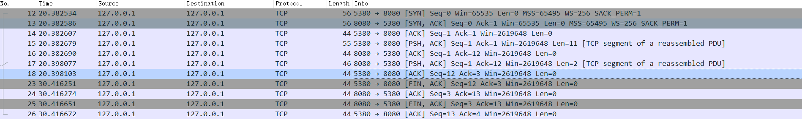
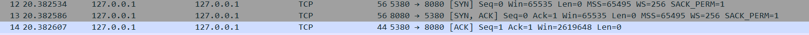
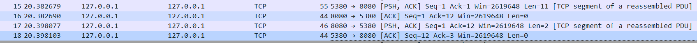
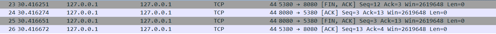

# 实验说明
整个实验很简单，先启动服务器，监听8080端口。然后启动客户端，客户端发起三次握手，然后发送test socket，
服务端返回ok。客户端发送完后等待10s然后发起四次挥手关闭连接

## 整个实现网络流程截图

## 三次握手

客户端先发送SYN请求，将初始化序号seq设置为0，并同步其他通信数据，如MSS等
服务端接收到请求，发送SYN，ACK响应。将初始化序号seq设置为0，ack设置为客户端的seq+1即1，并同步其他通信数据。
客户端收到SYN，ACK响应，发送ACK，将初始化需要seq设置为1，ack设置为服务端的seq+1即1。
到此三次握手结束。三次握手主要是为了保证双方的接收和发送能力都是正常的。

## 通信

客户端发送PSH，ACK请求，设置seq为1,ack为1，test socket共11个字符，长度为11。
服务端发送ack响应，设置seq为1，ack为1+11即12。
服务端发送ok请求，设置seq为1，ack为12，ok共2个字符，长度为2。
客户端收到响应，设置seq为12，ack为1+2即3

## 四次挥手

客户端发起FIN，ACK请求，设置seq为12，ack为3
服务端收到，发送ACK，设置seq为3，ack为12+1=13
服务器发送FIN，ACK请求，设置seq为3，ack为13
客户端收到，发送ACK，设置seq为13，ack为3+1=4

三次握手和四次挥手过程，虽然数据长度为0，但是seq要递增